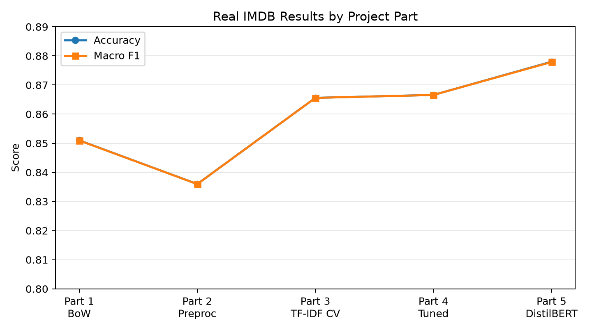
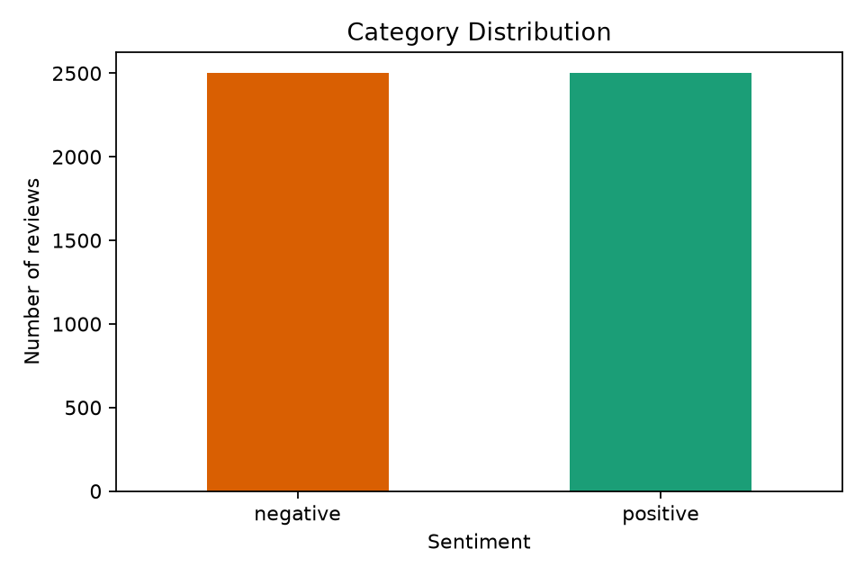
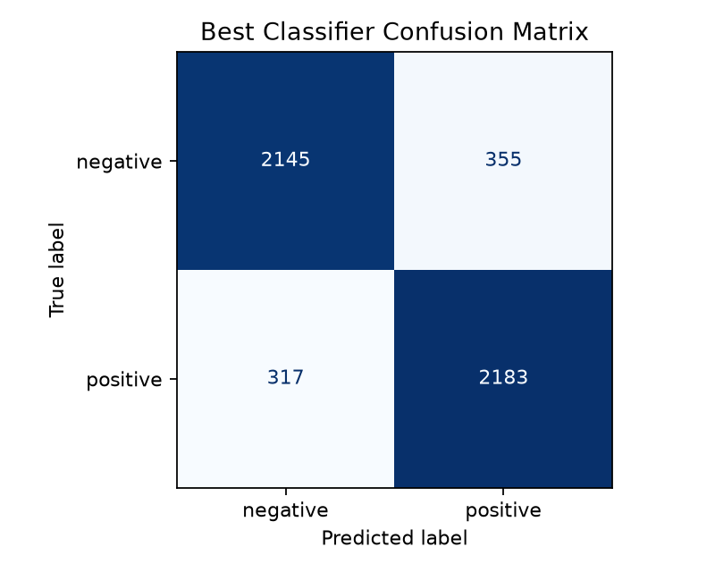

# NLP Final Project - Sentiment Classification

Text classification final project for the Natural Language Processing course.

## Submitters

- Saleem Yousef
- Noor Shama

## What This Project Does

This project classifies English IMDB movie reviews as positive or negative. It starts with a Bag-of-Words baseline, adds preprocessing, compares several classical ML classifiers with cross-validation, tunes and analyzes the best classical model, and compares the result against a pretrained HuggingFace sentiment model.

## Current Status

The code is implemented and real results were generated from `data/imdb_reviews.csv` using a balanced 5,000-review subset.

The final report draft is available at `docs/FINAL_REPORT.md`. Use the generated `outputs/` files as appendix material if Moodle requires them.

## Real Results



| Part | Main Approach | Evaluation | Accuracy | Macro F1 | Result |
|---|---|---:|---:|---:|---|
| Part 1 | Bag-of-Words + Logistic Regression | 1,000-review holdout | 0.851 | 0.851 | Strong baseline |
| Part 2 | Preprocessed Bag-of-Words + Logistic Regression | 1,000-review holdout | 0.836 | 0.836 | Preprocessing reduced performance |
| Part 3 | TF-IDF + Logistic Regression | 5-fold CV | 0.866 | 0.866 | Best classifier in comparison |
| Part 4 | TF-IDF bigrams + tuned Logistic Regression | 5-fold CV | 0.867 | 0.867 | Best classical model |
| Part 5 | HuggingFace DistilBERT sentiment pipeline | 500-review evaluation subset | 0.878 | 0.878 | Best overall model |

### Part 1 - Dataset And Baseline

The dataset subset is balanced: 2,500 positive and 2,500 negative reviews. The Bag-of-Words Logistic Regression baseline reached `0.851` accuracy and `0.851` macro F1.



### Part 2 - Preprocessing

Preprocessing included lowercasing, tokenization, stop-word removal, and stemming. It reduced accuracy from `0.851` to `0.836`, which suggests that some removed words or stemmed forms carried useful sentiment information.

| Version | Accuracy | Macro F1 |
|---|---:|---:|
| Raw Bag-of-Words | 0.851 | 0.851 |
| Preprocessed Bag-of-Words | 0.836 | 0.836 |

### Part 3 - Classifier Comparison

TF-IDF with review-length features was evaluated using 5-fold cross-validation. Logistic Regression performed best, while kNN performed poorly on sparse high-dimensional text vectors.

| Classifier | Accuracy Mean | Macro F1 Mean |
|---|---:|---:|
| Logistic Regression | 0.866 | 0.866 |
| Naive Bayes | 0.858 | 0.858 |
| SVM | 0.857 | 0.857 |
| Random Forest | 0.830 | 0.830 |
| kNN | 0.506 | 0.355 |



### Part 4 - Improvement And Error Analysis

The best classical model was TF-IDF with bigrams and tuned Logistic Regression regularization (`C=2.0`). It reached `0.867` cross-validated macro F1.

| Variant | Accuracy Mean | Macro F1 Mean |
|---|---:|---:|
| TF-IDF bigrams + tuned C | 0.867 | 0.867 |
| TF-IDF bigrams | 0.866 | 0.866 |
| TF-IDF unigrams | 0.859 | 0.859 |
| TF-IDF bigrams limited features | 0.850 | 0.850 |

Error analysis and influential words are available in:

- `outputs/part4/error_analysis.csv`
- `outputs/part4/influential_words.csv`

### Part 5 - Pretrained Model

The HuggingFace DistilBERT sentiment pipeline was evaluated on raw original text, not preprocessed text. It achieved the best score: `0.878` accuracy and `0.878` macro F1 on a 500-review evaluation subset.

| Version | Evaluated Rows | Accuracy | Macro F1 |
|---|---:|---:|---:|
| Part 1 Bag-of-Words baseline | 1000 | 0.851 | 0.851 |
| Part 4 best classical model | 1000 | 0.861 | 0.861 |
| Part 5 HuggingFace pretrained model | 500 | 0.878 | 0.878 |

## Repository Structure

```text
data/
  sample_reviews.csv              # tracked smoke-test data
  imdb_reviews.csv                # local real dataset, ignored by Git
src/nlp_final_project/
  data.py                         # CSV loading and stratified sampling
  text_processing.py              # preprocessing function
  features.py                     # review-length feature transformer
  modeling.py                     # shared model builders
  part1_baseline.py
  part2_preprocessing.py
  part3_classifier_comparison.py
  part4_improve_analyze.py
  part5_pretrained_compare.py
docs/
  assets/
    category_distribution.png
    best_confusion_matrix.png
    final_results_comparison.png
  ASSIGNMENT_REQUIREMENTS.md
  BEFORE_SUBMISSION.md
  FINAL_REPORT_TEMPLATE.md
  PROJECT_GUIDE.md
  REAL_RESULTS_SUMMARY.md
outputs/                          # generated local results, ignored by Git
requirements.txt
requirements-pretrained.txt
```

## Setup

```bash
python -m venv .venv
.venv\Scripts\activate
pip install -r requirements.txt
```

For the HuggingFace pretrained model:

```bash
pip install -r requirements-pretrained.txt
```

## Dataset

The real dataset should be placed at:

```text
data/imdb_reviews.csv
```

Expected columns:

- text column: `review`, `text`, `content`, or `sentence`
- label column: `sentiment`, `label`, `target`, or `category`

Accepted labels:

- positive: `positive`, `pos`, `1`, `true`
- negative: `negative`, `neg`, `0`, `false`

## Run The Project

Smoke test with the included sample data:

```bash
python -m src.nlp_final_project.part1_baseline --csv-path data/sample_reviews.csv
python -m src.nlp_final_project.part2_preprocessing --csv-path data/sample_reviews.csv
python -m src.nlp_final_project.part3_classifier_comparison --csv-path data/sample_reviews.csv
python -m src.nlp_final_project.part4_improve_analyze --csv-path data/sample_reviews.csv
python -m src.nlp_final_project.part5_pretrained_compare --csv-path data/sample_reviews.csv --skip-pretrained
```

Run on the real IMDB dataset:

```bash
python -m src.nlp_final_project.part1_baseline --csv-path data/imdb_reviews.csv --sample-size 5000
python -m src.nlp_final_project.part2_preprocessing --csv-path data/imdb_reviews.csv --sample-size 5000
python -m src.nlp_final_project.part3_classifier_comparison --csv-path data/imdb_reviews.csv --sample-size 5000
python -m src.nlp_final_project.part4_improve_analyze --csv-path data/imdb_reviews.csv --sample-size 5000
python -m src.nlp_final_project.part5_pretrained_compare --csv-path data/imdb_reviews.csv --sample-size 5000 --max-pretrained-samples 500
```

Part 5 uses original raw text for the pretrained model, not preprocessed/stemmed text.

## Generated Outputs

Generated outputs are written under `outputs/` and ignored by Git.

Important submission files:

- `outputs/part1/category_distribution.png`
- `outputs/part1/dataset_summary.csv`
- `outputs/part1/metrics.json`
- `outputs/part2/preprocessing_comparison.csv`
- `outputs/part2/conclusion.txt`
- `outputs/part3/classifier_comparison.csv`
- `outputs/part3/best_confusion_matrix.png`
- `outputs/part4/improvement_table.csv`
- `outputs/part4/influential_words.csv`
- `outputs/part4/error_analysis.csv`
- `outputs/part5/final_comparison.csv`
- `outputs/part5/part4_error_recheck.csv`

## Documentation

- `docs/PROJECT_GUIDE.md`: detailed implementation and run guide
- `docs/REAL_RESULTS_SUMMARY.md`: real result summary for the report
- `docs/FINAL_REPORT.md`: final report draft
- `docs/FINAL_REPORT_TEMPLATE.md`: 2-3 page report outline
- `docs/BEFORE_SUBMISSION.md`: final checklist
- `docs/ASSIGNMENT_REQUIREMENTS.md`: extracted assignment requirements
